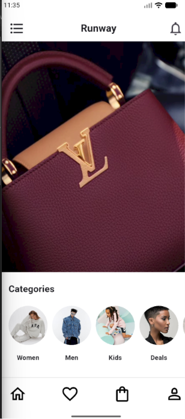
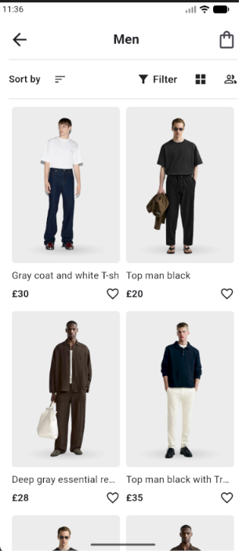
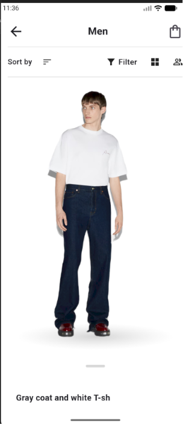
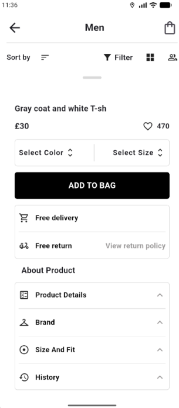

# 👕 Runway - Fashion Store UI

A fashion store UI project built with Flutter.

## 📱 Overview

Runway is a Flutter UI practice project inspired by modern fashion e-commerce applications.

## ✨ Features

- Fashion home page
- Categories browsing
- Product grid
- Product details UI
- Filter and sorting interface
- Bottom navigation

## 🛠 Technologies

- Flutter
- Dart
- Material Design

## 📸 Screenshots

## 👨‍💻 Developer

Yousif Salama
